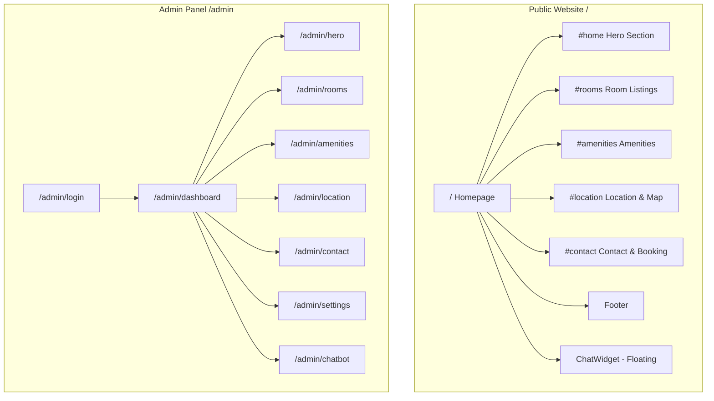
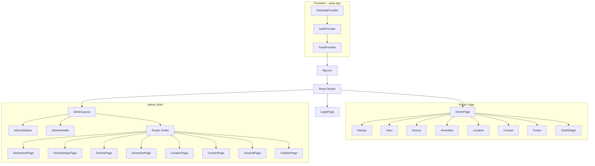
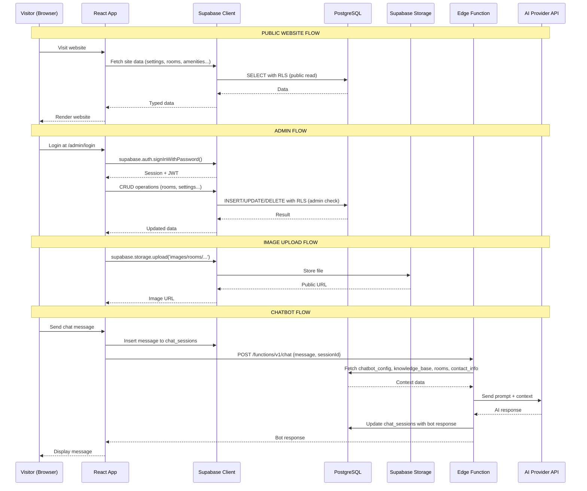

# 🏗️ ThaiNguyen Stay — Site Structure

> Kiến trúc hệ thống hoàn chỉnh: sitemap, database schema, Supabase configuration, API architecture.

---

## 1. Sitemap



### Route Definitions

| Path | Component | Auth | Mô tả |
|------|-----------|------|--------|
| `/` | `HomePage` | ❌ | Trang chủ public (tất cả sections) |
| `/admin/login` | `LoginPage` | ❌ | Đăng nhập admin |
| `/admin/dashboard` | `DashboardPage` | ✅ | Tổng quan, thống kê |
| `/admin/hero` | `HeroSettingsPage` | ✅ | Chỉnh sửa Hero section |
| `/admin/rooms` | `RoomsPage` | ✅ | Quản lý phòng (CRUD) |
| `/admin/amenities` | `AmenitiesPage` | ✅ | Quản lý tiện ích (CRUD) |
| `/admin/location` | `LocationPage` | ✅ | Vị trí & điểm du lịch |
| `/admin/contact` | `ContactPage` | ✅ | Thông tin liên hệ & chính sách |
| `/admin/settings` | `GeneralPage` | ✅ | Tên site, logo, SEO, footer, socials |
| `/admin/chatbot` | `ChatbotPage` | ✅ | Cấu hình chatbot & knowledge base |

---

## 2. Component Architecture



---

## 3. Database Schema (Supabase / PostgreSQL)

### 3.1 `profiles` — Admin user profiles
> Extends Supabase `auth.users` via foreign key

| Column | Type | Constraints | Mô tả |
|--------|------|-------------|--------|
| `id` | `uuid` | PK, FK → `auth.users.id`, ON DELETE CASCADE | User ID |
| `display_name` | `text` | NOT NULL | Tên hiển thị |
| `role` | `text` | NOT NULL, DEFAULT `'admin'` | Vai trò |
| `avatar_url` | `text` | NULLABLE | Avatar URL |
| `created_at` | `timestamptz` | DEFAULT `now()` | Ngày tạo |
| `updated_at` | `timestamptz` | DEFAULT `now()` | Ngày cập nhật |

---

### 3.2 `site_settings` — Cài đặt chung (key-value store)
| Column | Type | Constraints | Mô tả |
|--------|------|-------------|--------|
| `id` | `uuid` | PK, DEFAULT `gen_random_uuid()` | |
| `key` | `text` | UNIQUE, NOT NULL | Khóa cài đặt |
| `value` | `jsonb` | NOT NULL | Giá trị (JSON) |
| `updated_at` | `timestamptz` | DEFAULT `now()` | |

**Keys dự kiến:**

| Key | Value Type | Mô tả |
|-----|-----------|--------|
| `site_name` | `string` | "ThaiNguyen Stay" |
| `site_tagline` | `string` | "Homestay Đẳng Cấp Thái Nguyên" |
| `logo_url` | `string` | URL logo |
| `seo_title` | `string` | Title tag |
| `seo_description` | `string` | Meta description |
| `footer_description` | `string` | Mô tả ở footer |
| `footer_services` | `string[]` | Danh sách dịch vụ footer |
| `social_links` | `{facebook, instagram, youtube, tiktok}` | Links mạng xã hội |
| `nav_links` | `{name, href}[]` | Menu navigation |

---

### 3.3 `hero_content` — Nội dung Hero section
| Column | Type | Constraints | Mô tả |
|--------|------|-------------|--------|
| `id` | `uuid` | PK, DEFAULT `gen_random_uuid()` | |
| `location_badge` | `text` | | "Thái Nguyên, Việt Nam" |
| `title_line1` | `text` | | "Trải nghiệm Homestay" |
| `title_line2` | `text` | | "Đẳng Cấp" |
| `description` | `text` | | Mô tả dưới title |
| `background_image` | `text` | | URL ảnh nền |
| `features` | `jsonb` | | `[{icon, label, sublabel}]` |
| `stats` | `jsonb` | | `[{value, label}]` |
| `cta_primary_text` | `text` | | "Xem phòng" |
| `cta_primary_link` | `text` | | "#rooms" |
| `cta_secondary_text` | `text` | | "Liên hệ ngay" |
| `cta_secondary_link` | `text` | | "#contact" |
| `updated_at` | `timestamptz` | DEFAULT `now()` | |

---

### 3.4 `rooms` — Phòng ốc
| Column | Type | Constraints | Mô tả |
|--------|------|-------------|--------|
| `id` | `uuid` | PK, DEFAULT `gen_random_uuid()` | |
| `name` | `text` | NOT NULL | Tên phòng |
| `price` | `text` | NOT NULL | Giá (VD: "800.000đ") |
| `capacity` | `text` | | Sức chứa ("2-3 người") |
| `size` | `text` | | Diện tích ("35m²") |
| `image_url` | `text` | | URL ảnh phòng |
| `amenities` | `jsonb` | DEFAULT `'[]'` | `["wifi","tv","ac"]` |
| `description` | `text` | | Mô tả chi tiết |
| `sort_order` | `integer` | DEFAULT `0` | Thứ tự hiển thị |
| `is_active` | `boolean` | DEFAULT `true` | Hiển thị/ẩn |
| `created_at` | `timestamptz` | DEFAULT `now()` | |
| `updated_at` | `timestamptz` | DEFAULT `now()` | |

---

### 3.5 `amenities` — Tiện ích
| Column | Type | Constraints | Mô tả |
|--------|------|-------------|--------|
| `id` | `uuid` | PK, DEFAULT `gen_random_uuid()` | |
| `icon` | `text` | NOT NULL | Tên icon lucide (VD: "wifi") |
| `title` | `text` | NOT NULL | Tiêu đề |
| `description` | `text` | | Mô tả |
| `sort_order` | `integer` | DEFAULT `0` | Thứ tự |
| `is_active` | `boolean` | DEFAULT `true` | Hiển thị/ẩn |
| `created_at` | `timestamptz` | DEFAULT `now()` | |
| `updated_at` | `timestamptz` | DEFAULT `now()` | |

---

### 3.6 `location_info` — Thông tin vị trí
| Column | Type | Constraints | Mô tả |
|--------|------|-------------|--------|
| `id` | `uuid` | PK, DEFAULT `gen_random_uuid()` | |
| `address` | `text` | NOT NULL | Địa chỉ đầy đủ |
| `map_embed_url` | `text` | | Google Maps embed URL |
| `google_maps_link` | `text` | | Link Google Maps |
| `latitude` | `decimal` | | Vĩ độ |
| `longitude` | `decimal` | | Kinh độ |
| `phone` | `text` | | SĐT cho "Gọi tìm đường" |
| `section_subtitle` | `text` | | "Vị Trí Đắc Địa" |
| `section_title` | `text` | | "Khám Phá Thái Nguyên" |
| `section_description` | `text` | | Mô tả section |
| `updated_at` | `timestamptz` | DEFAULT `now()` | |

---

### 3.7 `attractions` — Điểm du lịch gần
| Column | Type | Constraints | Mô tả |
|--------|------|-------------|--------|
| `id` | `uuid` | PK, DEFAULT `gen_random_uuid()` | |
| `name` | `text` | NOT NULL | Tên điểm du lịch |
| `distance` | `text` | | "15km" |
| `travel_time` | `text` | | "25 phút" |
| `sort_order` | `integer` | DEFAULT `0` | |
| `is_active` | `boolean` | DEFAULT `true` | |
| `created_at` | `timestamptz` | DEFAULT `now()` | |

---

### 3.8 `contact_info` — Thông tin liên hệ (key-value)
| Column | Type | Constraints | Mô tả |
|--------|------|-------------|--------|
| `id` | `uuid` | PK, DEFAULT `gen_random_uuid()` | |
| `key` | `text` | UNIQUE, NOT NULL | Khóa |
| `value` | `jsonb` | NOT NULL | Giá trị |
| `updated_at` | `timestamptz` | DEFAULT `now()` | |

**Keys dự kiến:**

| Key | Value Structure |
|-----|----------------|
| `phone` | `{ number: "0912.345.678", link: "tel:+84912345678" }` |
| `zalo` | `{ number: "0912.345.678", link: "https://zalo.me/0912345678" }` |
| `email` | `{ address: "booking@thainguyenstay.com" }` |
| `address` | `{ full: "Đường Nguyễn Du, ..." }` |
| `bank_info` | `{ bank: "MB Bank", account: "0123 456 789", qr_image: "/images/qr-code.png" }` |
| `working_hours` | `[{ day: "Thứ 2 - Thứ 6", hours: "08:00 - 22:00" }, ...]` |
| `booking_methods` | `[{ title: "Gọi Điện Thoại", detail: "0912.345.678", ... }]` |
| `cancellation_policy` | `[{ rule: "Hủy trước 48 giờ", result: "hoàn 100%" }, ...]` |
| `section_subtitle` | `"Liên Hệ & Đặt Phòng"` |
| `section_title` | `"Đặt Phòng Nhanh Chóng"` |
| `section_description` | `"Nhiều phương thức..."` |

---

### 3.9 `chatbot_config` — Cấu hình Chatbot
| Column | Type | Constraints | Mô tả |
|--------|------|-------------|--------|
| `id` | `uuid` | PK, DEFAULT `gen_random_uuid()` | |
| `is_active` | `boolean` | DEFAULT `false` | Bật/tắt chatbot |
| `api_provider` | `text` | | 'openai', 'gemini', 'anthropic', 'groq', 'custom' |
| `api_key_encrypted` | `text` | | API key (encrypted) |
| `api_endpoint` | `text` | | Custom endpoint URL |
| `model` | `text` | | Model name (gpt-4o, gemini-pro, etc.) |
| `system_prompt` | `text` | | System prompt cho AI |
| `welcome_message` | `text` | | Tin nhắn chào mừng |
| `quick_replies` | `jsonb` | DEFAULT `'[]'` | Nút trả lời nhanh |
| `max_tokens` | `integer` | DEFAULT `500` | Max tokens per response |
| `temperature` | `decimal` | DEFAULT `0.7` | Temperature |
| `updated_at` | `timestamptz` | DEFAULT `now()` | |

**Supported AI Providers:**

| Provider | Models | Endpoint Format |
|----------|--------|----------------|
| OpenAI | gpt-4o, gpt-4o-mini, gpt-4-turbo, gpt-3.5-turbo | `https://api.openai.com/v1/chat/completions` |
| Google Gemini | gemini-2.0-flash, gemini-1.5-pro, gemini-1.5-flash | `https://generativelanguage.googleapis.com/v1beta/` |
| Anthropic | claude-sonnet-4-20250514, claude-3.5-haiku | `https://api.anthropic.com/v1/messages` |
| Groq | llama-3.1-70b, mixtral-8x7b | `https://api.groq.com/openai/v1/chat/completions` |
| Custom | (user-defined) | (user-defined, OpenAI-compatible) |

---

### 3.10 `knowledge_base` — Kiến thức Chatbot
| Column | Type | Constraints | Mô tả |
|--------|------|-------------|--------|
| `id` | `uuid` | PK, DEFAULT `gen_random_uuid()` | |
| `category` | `text` | NOT NULL | Phân loại |
| `question` | `text` | NOT NULL | Câu hỏi mẫu |
| `answer` | `text` | NOT NULL | Câu trả lời |
| `keywords` | `text[]` | DEFAULT `'{}'` | Keywords cho fuzzy matching |
| `sort_order` | `integer` | DEFAULT `0` | |
| `is_active` | `boolean` | DEFAULT `true` | |
| `created_at` | `timestamptz` | DEFAULT `now()` | |
| `updated_at` | `timestamptz` | DEFAULT `now()` | |

**Categories:** `đặt_phòng`, `giá_cả`, `tiện_ích`, `vị_trí`, `chính_sách`, `dịch_vụ`, `khác`

---

### 3.11 `chat_sessions` — Lịch sử Chat
| Column | Type | Constraints | Mô tả |
|--------|------|-------------|--------|
| `id` | `uuid` | PK, DEFAULT `gen_random_uuid()` | |
| `session_id` | `text` | NOT NULL | Client session ID |
| `messages` | `jsonb` | DEFAULT `'[]'` | `[{role, content, timestamp}]` |
| `metadata` | `jsonb` | | `{user_agent, referrer}` |
| `created_at` | `timestamptz` | DEFAULT `now()` | |
| `updated_at` | `timestamptz` | DEFAULT `now()` | |

---

## 4. Supabase Storage

### Buckets

| Bucket | Access | Mô tả |
|--------|--------|--------|
| `images` | Public | Tất cả hình ảnh website |

### Folder Structure
```
images/
├── hero/           # Ảnh nền Hero section
├── rooms/          # Ảnh phòng
├── general/        # Logo, QR code, misc
└── uploads/        # Admin uploads khác
```

### Storage Policies
- **Public read**: Ai cũng có thể đọc (hiển thị trên website)
- **Authenticated write**: Chỉ admin đăng nhập mới có thể upload/delete
- **File restrictions**: image/*, max 5MB

---

## 5. Row Level Security (RLS) Policies

### Public Read Access
```sql
-- Cho phép tất cả đọc dữ liệu public
CREATE POLICY "Public read" ON site_settings FOR SELECT USING (true);
CREATE POLICY "Public read" ON hero_content FOR SELECT USING (true);
CREATE POLICY "Public read" ON rooms FOR SELECT USING (is_active = true);
CREATE POLICY "Public read" ON amenities FOR SELECT USING (is_active = true);
CREATE POLICY "Public read" ON location_info FOR SELECT USING (true);
CREATE POLICY "Public read" ON attractions FOR SELECT USING (is_active = true);
CREATE POLICY "Public read" ON contact_info FOR SELECT USING (true);
```

### Admin Full Access
```sql
-- Admin có full quyền trên tất cả bảng
CREATE POLICY "Admin full access" ON rooms
  FOR ALL USING (
    EXISTS (SELECT 1 FROM profiles WHERE id = auth.uid() AND role = 'admin')
  );
-- Tương tự cho tất cả bảng khác...
```

### Chat Sessions
```sql
-- Public insert (khách hàng tạo session)
CREATE POLICY "Public insert" ON chat_sessions FOR INSERT WITH CHECK (true);
-- Public update (khách hàng thêm tin nhắn)
CREATE POLICY "Public update" ON chat_sessions FOR UPDATE USING (true);
-- Admin read (xem lịch sử)
CREATE POLICY "Admin read" ON chat_sessions FOR SELECT USING (
  EXISTS (SELECT 1 FROM profiles WHERE id = auth.uid() AND role = 'admin')
);
```

### Chatbot Config — Admin Only
```sql
-- Chỉ admin đọc/ghi (bảo vệ API keys)
CREATE POLICY "Admin only" ON chatbot_config
  FOR ALL USING (
    EXISTS (SELECT 1 FROM profiles WHERE id = auth.uid() AND role = 'admin')
  );
```

---

## 6. Data Flow Architecture



---

## 7. Edge Function: Chatbot

### Endpoint
```
POST /functions/v1/chat
```

### Request
```json
{
  "message": "Phòng nào giá rẻ nhất?",
  "session_id": "uuid-string",
  "history": [
    { "role": "user", "content": "Xin chào" },
    { "role": "assistant", "content": "Chào bạn! Tôi có thể giúp gì?" }
  ]
}
```

### Response
```json
{
  "reply": "Phòng Studio Hiện Đại có giá 600.000đ/đêm, phù hợp cho 2 người...",
  "source": "ai"
}
```

### Logic Flow
1. Nhận tin nhắn + session history
2. Query `knowledge_base` tìm FAQ match (keyword matching)
3. Nếu match → trả lời ngay từ KB, `source: "knowledge_base"`
4. Nếu không → build context từ DB:
   - Rooms (tên, giá, sức chứa, tiện ích)
   - Amenities (danh sách dịch vụ)
   - Contact info (SĐT, email, giờ làm việc)
   - Location (địa chỉ, điểm du lịch gần)
   - Knowledge base entries
5. Gọi AI API (theo config: OpenAI/Gemini/Anthropic/Custom)
6. Trả response, `source: "ai"`
7. Fallback nếu AI API fail → trả lời generic + link liên hệ

---

## 8. Environment Configuration

### `.env.example`
```bash
# Supabase Configuration
VITE_SUPABASE_URL=https://your-project.supabase.co
VITE_SUPABASE_ANON_KEY=your-anon-key

# Optional: Analytics
VITE_GA_TRACKING_ID=
```

### Supabase Edge Function Secrets
```bash
# Set via Supabase CLI or Dashboard
# These are NOT in .env.local — they live in Supabase
SUPABASE_SERVICE_ROLE_KEY=  # Auto-available in Edge Functions
```

> **Note**: AI API keys are stored in the `chatbot_config` table (encrypted), NOT in environment variables. This allows admin to change them via the UI.

---

*Cập nhật lần cuối: 2026-05-24*
*Version: 1.0.0*
